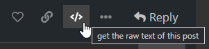
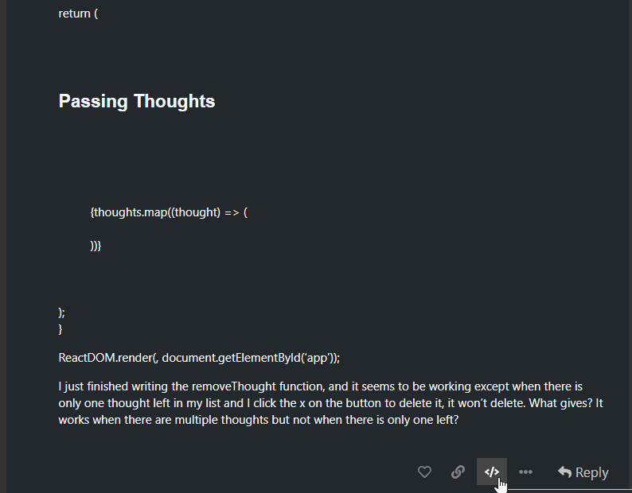

# Codecademy Raw Post Viewer Userscript

Userscript to add a button to each post that shows the unformatted (raw) post without requiring special user permissions.

_*compatible with all themes_

## Installation

1. Make sure you have user scripts enabled in your browser:

    * Chrome - install [Tampermonkey](https://chrome.google.com/webstore/detail/tampermonkey/dhdgffkkebhmkfjojejmpbldmpobfkfo)
    * Firefox - install [Tampermonkey](https://addons.mozilla.org/firefox/addon/tampermonkey/) or [Greasemonkey](https://addons.mozilla.org/firefox/addon/greasemonkey/)

    * Only tested on Chrome & Firefox using Tampermonkey & Greasemonkey, but would likely work with other modern browsers and other userscript engines. No extension-specific features are used.

2. Install "Codecademy Raw Post Viewer" by clicking [here](https://github.com/selectlearns/codecademy-forums-userscripts/raw/main/cc-forums-raw-viewer.user.js)

## Usage

1. Click the new button that has been added to the button palette of each post

2. To return to the formatted view, click anywhere outside of unformatted box.